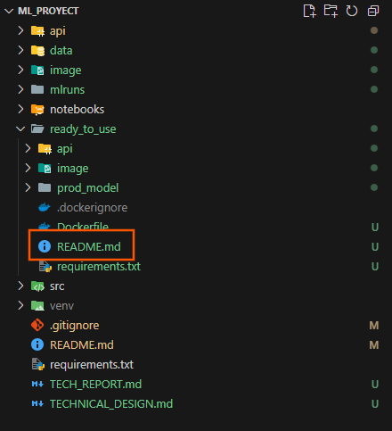

# Predictive Maintenance ML API

A full MLOps pipeline for predicting machine failures based on sensor telemetry data. This repository includes data preprocessing, model training and tracking with MLflow, inference with FastAPI, and containerization with Docker.

---

## 🚀 For a quick test of the model, go directly to the README.md file in the "ready to use" folder. There you will find instructions on how to run the model quickly.

---

## 📂 How to Navigate the Repo

| Folder/File           | Purpose                                                                                                                            |
| --------------------- | ---------------------------------------------------------------------------------------------------------------------------------- |
| `api/`              | FastAPI app with `/predict` endpoint                                                                                             |
| `data/`             | Contains raw and processed data                                                                                                    |
| `image/`            | contains images used in thr README file                                                                                            |
| `mlruns/`           | Local MLflow tracking directory                                                                                                    |
| `notebooks/`        | Exploratory data analysis (EDA)                                                                                                    |
| `ready_to_use`      | folder with model + docker                                                                                                         |
| `src/`              | Contains preprocessing and training scripts                                                                                        |
| `venv`              | virtual environment                                                                                                                |
| `.gitignore`        | Prevents local files (e.g. venv/) from being copied                                                                                |
| `README.md`         | usage guide                                                                                                                        |
| `requirements.txt`  | file containing dependencies                                                                                                       |
| `tech_report.md`    | Results obtained, key decisions, trade-offs, lessons learned, and next steps.                                                      |
| `technical_design/` | Describes the architecture, data flow, components, diagrams, and decisions for the implementation of the machine learning project. |
