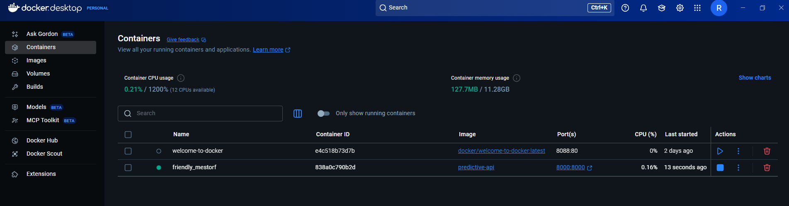
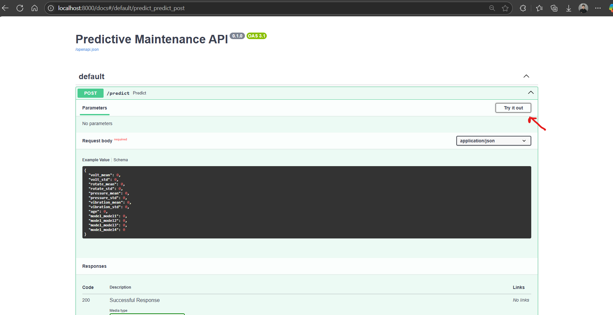
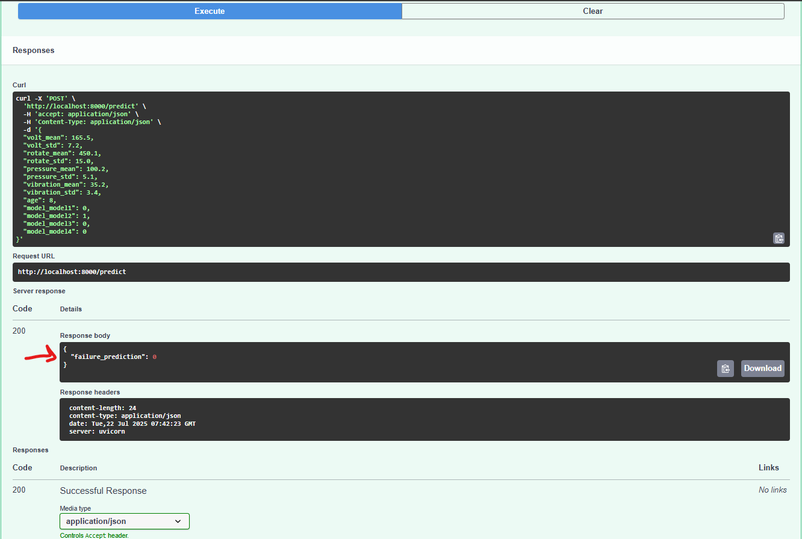

## How to Run the Model Ready to Use.

* notes  *

If you have docker desktop you could see the containers and turn off and turn on its more amigable :)




in terminal CMD execute lines

### 1.  Build the Docker image inside folder "ready_to_use"

```bash
docker build -t predictive-api .
```

### 2.  Run the container

```bash
docker run -p 8000:8000 predictive-api
```

### 3.  Access the API

Open your browser:

```
http://localhost:8000/docs
```

- push the button "try it out" for try the model



take this sample and put on example value

---

## Sample Prediction Input

{
  "volt_mean": 165.5,
  "volt_std": 7.2,
  "rotate_mean": 450.1,
  "rotate_std": 15.0,
  "pressure_mean": 100.2,
  "pressure_std": 5.1,
  "vibration_mean": 35.2,
  "vibration_std": 3.4,
  "age": 8,
  "model_model1": 0,
  "model_model2": 1,
  "model_model3": 0,
  "model_model4": 0
}

Execute and take your prediction. 👌


